# 💄 L'Oréal Datathon: The AI-Powered Trend Spotter

 

This repository contains the complete project for the L'Oréal Datathon, where we developed an AI-driven system to identify and forecast emerging trends in the beauty industry from video content data.

Our solution moves beyond simple analytics to provide a forward-looking view of what's next in beauty.

---

## ✨ See Our Trend Spotter in Action!

Our interactive dashboard brings our findings to life, allowing you to explore content clusters, view historical trends, and see future forecasts for specific beauty niches.

**Visit our live dashboard:**

### ➡️ [**loreal-datathon-analysis.streamlit.app**](http://loreal-datathon-analysis.streamlit.app) ⬅️

---

##  prezentare generală a proiectului

For a deeper dive into our methodology, findings, and strategic recommendations, please see our pitch deck and video presentation.

| Resource | Link |
| :--- | :--- |
| 📊 **Pitch Deck** | [**View on Canva**](https://www.canva.com/design/DAGyt8lrlZA/ID6IJUGyIZl0z5SQnL3pew/edit) |
| 📹 **Video Presentation** | [**Watch Here**](https://youtu.be/B6FwShRsvyU?si=aDoObXWaQEpTmyDu) |

---

## 📂 Repository Contents

This repository contains all the necessary components of our project, from the Streamlit application code to the final processed datasets.

-   **`app.py` & `functions.py`**: The core Python scripts that power our interactive Streamlit dashboard.
-   **`cleaned_data_pipeline.ipynb`**: The complete Jupyter Notebook containing the end-to-end data processing, clustering, and forecasting models.
-   **`videos_subclusters_corrected.csv`**: The final, cleaned dataset produced by our data pipeline. This file contains the raw video data enriched with our AI-generated topic and sub-topic labels.
-   **`Holt_Winters_Parameters_anomaly.csv`**: The final output of the forecasting module. This CSV contains the optimized Holt-Winters parameters for each content niche, enabling accurate future predictions.

# 📈 Complete Data Pipeline Explanation: From Raw Video Data to Actionable Forecasts

This repository contains the `cleaned_data_pipeline.ipynb`, a sophisticated end-to-end data science project that transforms a raw dataset of video metadata into a powerful forecasting tool. The pipeline automatically discovers content trends, groups videos into niche topics, and builds robust time-series models to predict future upload volumes for each niche.

---

## 🚀 Core Features

-   **Automated Topic Discovery**: Leverages **Sentence Transformers** and **KMeans Clustering** to move beyond simple keyword analysis and understand the semantic *meaning* of video titles.
-   **Hierarchical Clustering**: First identifies broad content pillars (e.g., "Makeup Tutorials") and then drills down into specific sub-topics (e.g., "Eye Shadow Looks," "Foundation Reviews") for granular insights.
-   **Intelligent Data Correction**: Implements an automated reassignment module using **Cosine Similarity** to intelligently correct initial misclassifications, ensuring data quality and model accuracy.
-   **Robust Anomaly-Aware Forecasting**: Employs the **Holt-Winters** method with **Rolling Cross-Validation** to find the optimal forecasting model for each content niche, automatically detecting and correcting for statistical anomalies in the training data.

---

## 📊 The Pipeline Explained

This pipeline is a multi-stage process where the output of one step becomes the input for the next, progressively refining the data to extract maximum value.

```mermaid
graph TD
    A[📁 1. Data Ingestion] --> B[🧹 2. Macro-Topic Clustering];
    B --> C[🔬 3. Micro-Topic Sub-Clustering];
    C --> D[🤖 4. Automated Cluster Refinement];
    D --> E[📈 5. Time-Series Forecasting];
    E --> F[🎯 Final Output: Forecasting Summary];

    subgraph "Data Loading & Prep"
        A
    end

    subgraph "Unsupervised ML for Topic Modeling"
        B
        C
    end

    subgraph "Advanced Data Cleaning"
        D
    end

    subgraph "Predictive Analytics"
        E
    end
```

### **Step 1: Data Ingestion & Preparation**
The pipeline kicks off by downloading the video dataset from Google Drive, unzipping it, and loading it into a Pandas DataFrame. The crucial `publishedAt` column is immediately converted to a datetime object, preparing it for time-series analysis.

### **Step 2: Macro-Topic Clustering**
To get a high-level view of the content, we first group videos into broad categories.
1.  **Text Embedding**: Video titles are converted into numerical vectors using the `all-MiniLM-L6-v2` Sentence Transformer model.
2.  **Optimal `k` Selection**: The **Elbow Method** is used to programmatically determine the ideal number of clusters, avoiding guesswork.
3.  **KMeans Clustering**: The KMeans algorithm assigns each video to a cluster.
4.  **Human-in-the-Loop**: The resulting clusters are given meaningful names (e.g., 'Educational Skincare & Wellness'), and irrelevant categories are filtered out.

### **Step 3: Micro-Topic Sub-Clustering**
With broad topics defined, we drill down to find more specific niches.
1.  **Domain-Specific Models**: For each macro-topic, a more specialized Sentence Transformer model (e.g., `BAAI/bge-base-en-v1.5`) is used to generate highly nuanced embeddings.
2.  **Secondary Clustering**: The same Elbow Method + KMeans process is run *within* each macro-topic to create granular sub-clusters (e.g., `Hair Styling & Transformations_1`).

### **Step 4: Automated Cluster Refinement**
Initial clustering isn't always perfect. This step intelligently cleans up the results.
1.  **Problem Identification**: A "catch-all" cluster ('General Beauty') is identified as containing misclassified videos.
2.  **Similarity Search**: For each video in a "bad" subcluster, we calculate its **cosine similarity** against all videos in its target "correct" cluster.
3.  **Automated Reassignment**: The video is automatically moved to the most similar sub-cluster, ensuring our final groupings are logical and coherent.

### **Step 5: Time-Series Forecasting with Anomaly Detection**
The final, most powerful step is to predict the future.
1.  **Data Aggregation**: For each clean sub-cluster, a monthly time-series is created by counting the number of videos published.
2.  **Anomaly Handling**: Before training, an initial Holt-Winters model identifies and smooths statistical outliers (e.g., a sudden viral spike) to prevent them from skewing the underlying trend and seasonality.
3.  **Hyperparameter Tuning**: A **Rolling Cross-Validation** framework rigorously tests all combinations of Holt-Winters parameters (trend, seasonal type, seasonal period) by training on expanding windows of data and forecasting a 6-month horizon.
4.  **Best Model Selection**: The parameter set with the lowest Mean Absolute Percentage Error (MAPE) across all validation windows is selected as the champion model for that sub-cluster.

---

## 🏁 Final Output

The pipeline concludes by generating the `forecasting_summary_df` DataFrame. This powerful summary table provides, for each content sub-cluster, the exact Holt-Winters parameters that yield the most accurate predictions and the expected forecast error (MAPE).

**Example Output:**

| subcluster | trend | seasonal | seasonal_periods | avg_mape |
| :--- | :--- | :--- | :--- | ---: |
| Makeup Tutorials & Challenges_2 | add | mul | 12 | 14.35 |
| Hair Styling & Transformations_4 | mul | add | 6 | 18.92 |
| Educational Skincare & Wellness_0 | add | add | 10 | 21.05 |

This output delivers directly actionable intelligence, enabling stakeholders to understand the predictability and seasonality of every content niche identified by the pipeline.
