# 💄 L'Oréal Datathon: The AI-Powered Trend Spotter

 

This repository contains the complete project for the L'Oréal Datathon, where we developed an AI-driven system to identify and forecast emerging trends in the beauty industry from video content data.

Our solution moves beyond simple analytics to provide a forward-looking view of what's next in beauty.

---

# ✨ See Our Trend Spotter in Action!

Our interactive dashboard brings our findings to life, allowing you to explore content clusters, view historical trends, and see future forecasts for specific beauty niches.

**Visit our live dashboard:**

### ➡️ [**loreal-datathon-analysis.streamlit.app**](http://loreal-datathon-analysis.streamlit.app) ⬅️

if you open up the dashboard and it says "This app has gone to sleep due to inactivity" just click on the blue button that says "Yes get this app back up"

## Dashboard snippets

---

#  Project Overview

For a deeper dive into our methodology and findings, please see our pitch deck and video presentation.

| Resource | Link |
| :--- | :--- |
| 📊 **Pitch Deck** | [**View on Canva**](https://www.canva.com/design/DAGyt8lrlZA/ID6IJUGyIZl0z5SQnL3pew/edit) |
| 📹 **Video Presentation** | [**Watch Here**](https://youtu.be/B6FwShRsvyU?si=aDoObXWaQEpTmyDu) |

---

# 📂 Repository Contents

This repository contains all the necessary components of our project, from the Streamlit application code to the final processed datasets.

-   **`app.py` & `functions.py`**: The core Python scripts that power our interactive Streamlit dashboard.
-   **`cleaned_data_pipeline.ipynb`**: The complete Jupyter Notebook containing the end-to-end data processing, clustering, and forecasting models.
-   **`videos_subclusters_corrected.csv`**: The final, cleaned dataset produced by our data pipeline. This file contains the raw video data enriched with our AI-generated topic and sub-topic labels.
-   **`Holt_Winters_Parameters_anomaly.csv`**: The final output of the forecasting module. This CSV contains the optimized Holt-Winters parameters for each content niche, enabling accurate future predictions.

# 📈 Complete Data Pipeline Explanation: From Raw Video Data to Actionable Forecasts

This repository contains the `cleaned_data_pipeline.ipynb`, a sophisticated end-to-end data science project that transforms a raw dataset of video metadata into a powerful forecasting tool. The pipeline automatically discovers content trends, groups videos into niche topics, and builds robust time-series models to predict future upload volumes for each niche.

---

## 🚀 Core Features

-   **Automated Topic Discovery**: Leverages **Sentence Transformers** and **KMeans Clustering** to move beyond simple keyword analysis and understand the semantic *meaning* of video titles.
-   **Hierarchical Clustering**: First identifies broad content pillars (e.g., "Makeup Tutorials") and then drills down into specific sub-topics (e.g., "Eye Shadow Looks," "Foundation Reviews") for granular insights.
-   **Intelligent Data Correction**: Implements an automated reassignment module using **Cosine Similarity** to intelligently correct initial misclassifications, ensuring data quality and model accuracy.
-   **Robust Anomaly-Aware Forecasting**: Employs the **Holt-Winters** method with **Rolling Cross-Validation** to find the optimal forecasting model for each content niche, automatically detecting and correcting for statistical anomalies in the training data.

---

## 📊 The Pipeline Explained

This pipeline is a multi-stage process where the output of one step becomes the input for the next, progressively refining the data to extract maximum value.

```mermaid
graph TD
    A[📁 1. Data Ingestion] --> B[🧹 2. Macro-Topic Clustering];
    B --> C[🔬 3. Micro-Topic Sub-Clustering];
    C --> D[🤖 4. Automated Cluster Refinement];
    D --> E[📈 5. Time-Series Forecasting];
    E --> F[🎯 Final Output: Forecasting Summary];

    subgraph "Data Loading & Prep"
        A
    end

    subgraph "Unsupervised ML for Topic Modeling"
        B
        C
    end

    subgraph "Advanced Data Cleaning"
        D
    end

    subgraph "Predictive Analytics"
        E
    end
```

### **Step 1: Data Ingestion & Preparation**
The pipeline kicks off by downloading the video dataset from Google Drive, unzipping it, and loading it into a Pandas DataFrame. The crucial `publishedAt` column is immediately converted to a datetime object, preparing it for time-series analysis.

### **Step 2: Macro-Topic Clustering**
To get a high-level view of the content, we first group videos into broad categories.
1.  **Text Embedding**: Video titles are converted into numerical vectors using the `all-MiniLM-L6-v2` Sentence Transformer model.
2.  **Optimal `k` Selection**: The **Elbow Method** is used to programmatically determine the ideal number of clusters, avoiding guesswork.
3.  **KMeans Clustering**: The KMeans algorithm assigns each video to a cluster.
4.  **Human-in-the-Loop**: The resulting clusters are given meaningful names (e.g., 'Educational Skincare & Wellness'), and irrelevant categories are filtered out.

### **Step 3: Micro-Topic Sub-Clustering**
With broad topics defined, we drill down to find more specific niches.
1.  **Domain-Specific Models**: For each macro-topic, a more specialized Sentence Transformer model (e.g., `BAAI/bge-base-en-v1.5`) is used to generate highly nuanced embeddings.
2.  **Secondary Clustering**: The same Elbow Method + KMeans process is run *within* each macro-topic to create granular sub-clusters (e.g., `Hair Styling & Transformations_1`).

### **Step 4: Automated Cluster Refinement**
Initial clustering isn't always perfect. This step intelligently cleans up the results.
1.  **Problem Identification**: A "catch-all" cluster ('General Beauty') is identified as containing misclassified videos.
2.  **Similarity Search**: For each video in a "bad" subcluster, we calculate its **cosine similarity** against all videos in its target "correct" cluster.
3.  **Automated Reassignment**: The video is automatically moved to the most similar sub-cluster, ensuring our final groupings are logical and coherent.

### **Step 5: Time-Series Forecasting with Anomaly Detection**
The final, most powerful step is to predict the future.
1.  **Data Aggregation**: For each clean sub-cluster, a monthly time-series is created by counting the number of videos published.
2.  **Anomaly Handling**: Before training, an initial Holt-Winters model identifies and smooths statistical outliers (e.g., a sudden viral spike) to prevent them from skewing the underlying trend and seasonality.
3.  **Hyperparameter Tuning**: A **Rolling Cross-Validation** framework rigorously tests all combinations of Holt-Winters parameters (trend, seasonal type, seasonal period) by training on expanding windows of data and forecasting a 6-month horizon.
4.  **Best Model Selection**: The parameter set with the lowest Mean Absolute Percentage Error (MAPE) across all validation windows is selected as the champion model for that sub-cluster.

---

## 🏁 Final Output

The pipeline concludes by generating the `forecasting_summary_df` DataFrame. This powerful summary table provides, for each content sub-cluster, the exact Holt-Winters parameters that yield the most accurate predictions and the expected forecast error (MAPE).

**Example Output:**

| subcluster | trend | seasonal | seasonal_periods | avg_mape |
| :--- | :--- | :--- | :--- | ---: |
| Makeup Tutorials & Challenges_2 | add | mul | 12 | 14.35 |
| Hair Styling & Transformations_4 | mul | add | 6 | 18.92 |
| Educational Skincare & Wellness_0 | add | add | 10 | 21.05 |

This output delivers directly actionable intelligence, enabling stakeholders to understand the predictability and seasonality of every content niche identified by the pipeline.

---

# 🔮 How do we use our Holt-Winters model to predict whether a trend will grow or decay?

A standard forecast might predict that a trend will see "150 videos next month." But how much should we trust that number? Is it a confident prediction, or is the trend too volatile to be sure? A single number hides the risk and uncertainty.

Our approach is different. We don't just provide a single prediction; we provide a **statistical verdict** on a trend's direction. We achieve this through a robust, four-step process that combines a classic forecasting model with a powerful simulation technique called **Residual Bootstrapping**.

---

## The Core Problem: A Single Forecast Isn't Enough

Imagine a trend's history is like a bumpy road. A simple forecast tries to draw a single, smooth line into the future. But we know the road ahead will also have bumps. Our goal is to measure how big those future bumps are likely to be, and in which direction they're leaning.

> Our method is designed to answer one critical question: **"Is the expected future performance statistically different from the recent past?"**

---

## Our 4-Step Process for Confident Predictions

Here is the step-by-step logic, as implemented in our Python code, to generate a reliable trend signal.

```mermaid
graph TD
    A[<strong>Step 1:</strong><br>Build a Solid Foundation] --> B[<strong>Step 2:</strong><br>Learn from Past Mistakes];
    B --> C[<strong>Step 3:</strong><br>Simulate 1,000 Possible Futures];
    C --> D[<strong>Step 4:</strong><br>The Statistical Showdown];
    D --> E[✅ <strong>Final Verdict:</strong><br>High Increase, High Decrease, or Uncertain];
```

### 1. 🔨 Step 1: Build a Solid Foundation

First, we build the best possible Holt-Winters model for the trend using the optimal parameters (`trend`, `seasonal`, `seasonal_periods`) discovered during our rigorous cross-validation phase.

Crucially, before this final training, we run an **anomaly detection** step. The `handle_anomalies` function finds and smooths any extreme, one-off historical data points (like a sudden viral spike) that could mislead the model. This ensures our model learns from the true, underlying pattern, not from statistical noise.

### 2. 📝 Step 2: Learn from Past Mistakes (The Residuals)

No model is perfect. We calculate all the historical errors our model made—the difference between its past predictions and the actual numbers. This collection of past mistakes is called **"residuals."**

These residuals are incredibly valuable. They represent the real-world randomness and volatility of the trend. They are the "DNA" of the trend's natural unpredictability.

### 3. 🎲 Step 3: Simulate 1,000 Possible Futures (Bootstrapping)

This is where the magic happens. Instead of just one future, we create 1,000 of them. The `train_and_forecast_with_bootstrap` function performs this simulation:

1.  It starts with the standard Holt-Winters forecast (a single, smooth line).
2.  It then runs a loop 1,000 times. In each simulation, it creates a new, unique future path by taking the standard forecast and **adding random "bumps"** to it. These bumps are randomly selected from our library of historical errors (the residuals).
3.  This process creates 1,000 plausible, slightly different versions of the future, each one respecting the trend's historical volatility.

### 4. ⚖️ Step 4: The Statistical Showdown

Now we have a distribution of 1,000 possible outcomes for the next 1, 3, or 6 months. The `generate_final_forecasts_and_signals` function performs the final test:

1.  **Establish the Baseline**: We calculate the `recent_sum`—the actual number of videos published in the last X months. This is a fixed, known value representing the recent past.
2.  **Define the Future Range**: From our 1,000 simulated future sums, we calculate an **80% Confidence Interval**. This gives us a `lower_bound_sum` and an `upper_bound_sum`. We can be 80% confident that the true future outcome will fall between these two numbers.
3.  **Make the Verdict**: We compare the fixed baseline to the future range. This is the simple but powerful logic that determines the final signal:
    -   `if lower_bound_sum > recent_sum:` If even the *most pessimistic* future simulation (the 10th percentile) is still higher than the recent past, we have a **HIGH INCREASE** signal. The evidence for growth is overwhelming.
    -   `elif upper_bound_sum < recent_sum:` If even the *most optimistic* future simulation (the 90th percentile) is still lower than the recent past, we have a **HIGH DECREASE** signal. The evidence for decay is overwhelming.
    -   `else:` If the `recent_sum` falls *within* our 80% confidence interval for the future, the signal is **UNCERTAIN**. We cannot statistically prove that the future will be different from the past. The trend is either stable or too noisy to call.

---

## ✅ The Result: Actionable Intelligence

By following this robust process, our system doesn't just give you a number. It gives you a **confident, defensible, and statistically-backed insight** into the future momentum of every beauty trend, allowing for smarter, data-driven decisions.

Of course. Based on your `app.py` and `functions.py` code, you have built a sophisticated and highly valuable data product. The key is to explain not just *what* it does, but *why* it's powerful. This README is designed to do exactly that.

Here is an eye-catching `README.md` for your data product.

---

# 📈 Dashboard and data product overview

  

Welcome to the AI Trend Spotter, a strategic tool designed to transform raw YouTube video data into actionable, forward-looking business intelligence. This dashboard moves beyond reactive analytics to provide proactive, data-driven forecasts on emerging beauty trends.

Our system automatically discovers niche content categories, models their historical performance, and simulates future possibilities to give L'Oréal a decisive edge in a fast-moving market.

---

## ✨ Key Features

-   🔮 **Probabilistic Forecasting**: Instead of a single, unreliable prediction, we use **Residual Bootstrapping** to run 1,000 simulations, generating a full distribution of possible futures for each trend.
-   🧠 **AI-Powered Explanations**: Features a one-click "Explain this Chart" button powered by **Google's Gemini AI**, which translates complex statistical results into clear, easy-to-understand business insights.
-   🔬 **Granular Topic Modeling**: Leverages advanced NLP to automatically categorize millions of videos into specific, meaningful niches like "Curly & Wavy Hair Care" or "Face Yoga & Anti-Aging Massage".
-   📊 **Interactive & Intuitive UI**: A clean, user-friendly Streamlit interface that allows anyone—from data scientists to brand managers—to explore trends, filter by topic, and understand the data story.
-   🚨 **Robust Anomaly Detection**: The forecasting models are automatically trained to identify and correct for historical anomalies (like a one-off viral spike), ensuring that the underlying trends are captured accurately.

---

## 🚀 How to Interpret the Dashboard: A Quick Guide

The dashboard is designed to tell a story, from a high-level overview to a deep statistical analysis.

#### 1. The Main Forecast Chart ("Forecast Story")

This is your primary view.
-   **Blue Line**: Represents the actual, historical number of videos published each month for the selected niche.
-   **Orange Dashed Line**: This is the model's single best-guess forecast for the next 6 months.
-   **Shaded Blue Area**: This is the **80% Confidence Interval**. It represents the range where our 1,000 simulations predict the actual value will fall 80% of the time. **A wider band means more uncertainty; a narrower band means higher confidence.**

#### 2. The Simulation Results ("Residual Bootstrapping")

This is the most powerful section. Instead of just one forecast, we show you the entire *distribution* of the 1,000 simulated futures.

-   **The "Bell Curve" (KDE Plot)**: This shows the probability of different outcomes. The peak of the curve is the most likely outcome.
-   **Recent Sum (Dashed Line)**: This vertical line shows the actual number of videos published in the last 1, 3, or 6 months. This is our baseline for comparison.
-   **The Three Zones**:
    -   🟢 **Green Zone (High Decrease)**: If the dashed "Recent Sum" line falls here, it means it's statistically *outside* the 80% confidence interval on the lower end. There is high confidence that the future volume will be an **decrease**.
    -   🔴 **Red Zone (High Increase)**: If the "Recent Sum" line falls here, it is statistically *outside* the confidence interval on the higher end. There is high confidence the trend is **increasing**.
    -   ⚪ **Gray Zone (Uncertain)**: If the "Recent Sum" line falls within the main gray area, the trend is considered stable or uncertain. The future outcome is too close to the recent past to declare a statistically significant change with high confidence.

---

## 💻 Technology Stack

-   **Dashboard**: Streamlit
-   **Data Manipulation**: Pandas, NumPy
-   **Time-Series Forecasting**: Statsmodels (Holt-Winters Exponential Smoothing)
-   **Visualization**: Plotly
-   **AI Explanations**: Google Gemini AI API

---
